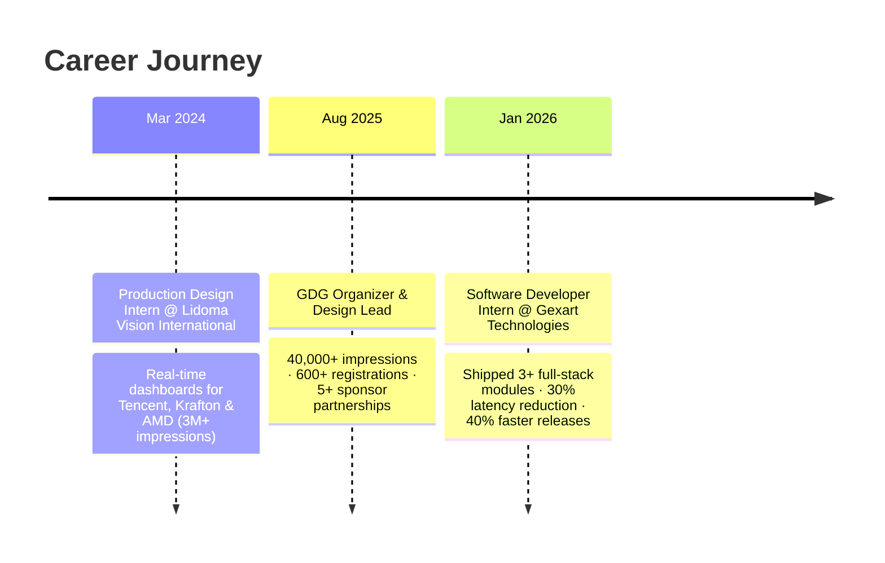

<div align="center">


# Hey, I'm Protyoy Bhandary 👋


[](https://git.io/typing-svg)

<a href="https://linkedin.com/in/protyoy-bhandary"></a>
<a href="mailto:bhandaryprotyoy@gmail.com"></a>
<a href="https://github.com/prox004"></a>


</div>

<br>

## 🚀 About Me

```yaml
name: Protyoy Bhandary
role: Full Stack Engineer & Blockchain Developer
location: Kolkata, India
education: B.Tech CSE @ MAKAUT (GPA 8.23/10.0)
currently_building: RendoFren — a decentralized GPU rendering network
currently_learning: [Rust, CI/CD, Kubernetes, Machine Learning]
ask_me_about: [Full-stack dev, Cloud platforms, Blockchain engineering]
fun_fact: "Also a Visual Designer with 6 years of experience 🎨"
```

- 🔭 Currently interning as a **Software Developer at Gexart Technologies**, shipping React/Node.js modules in production
- 🌐 Organizing workshops & hackathons as a **Google Developer Group (GDG) Lead**
- ⚡ Building decentralized systems — GPU render markets, on-chain invoicing, AI career tooling
- 📫 Reach me at **bhandaryprotyoy@gmail.com**

<br>

## 🛠️ Tech Stack

<div align="center">


</div>

<details>
<summary><b>🔎 Full breakdown by category</b></summary>
<br>

| Category | Stack |
|---|---|
| **Languages** | Java, Python, C, Solidity |
| **Frontend** | React, React Native, TailwindCSS, Vite |
| **Backend** | Node.js, Express.js, Django, REST APIs |
| **Databases** | MySQL, MongoDB, Redis, Firebase |
| **Cloud** | AWS, GCP, Azure |
| **Blockchain** | Ethereum, Hardhat, Web3.js, Ethers.js, IPFS |
| **Tools** | Git, GitHub, Linux |

</details>

<br>

## 💼 Experience Timeline



<br>

## 🧪 Featured Projects

<table>
<tr>
<td width="50%" valign="top">

### 🖥️ [RendoFren](https://github.com/prox004/rendofren)
**Decentralized GPU Rendering Network**

Distributed rendering pipeline (BullMQ + Redis + Python workers) with parallel frame processing across N GPU nodes — **60% faster** render times. AES-256 encrypted transfer, IPFS storage, and Ethereum escrow contracts for 100+ trustless simulated transactions.

`Python` `Redis` `BullMQ` `Ethereum` `IPFS`

</td>
<td width="50%" valign="top">

### 💰 [Worthy.ai](https://github.com/prox004/worthy-ai)
**AI-Powered Career Intelligence Platform**

Salary benchmarking + AI resume parsing across 500+ data points/candidate with **85%+ accuracy**. GitHub & LinkedIn API integration cut manual screening effort by **50%** for recruiters and job-seekers alike.

`AI/ML` `GitHub API` `LinkedIn API` `Node.js`

</td>
</tr>
<tr>
<td width="50%" valign="top">

### 🧾 [Automint](https://github.com/prox004/automint)
**Decentralized Smart Auto Invoicing Platform**

Ethereum smart contracts automating invoice generation, validation & settlement — **100%** elimination of manual reconciliation. Web3 wallet connectivity + real-time payment tracking via Ethers.js for immutable transaction records.

`Solidity` `Ethers.js` `Web3` `Smart Contracts`

</td>
<td width="50%" valign="top">

### 🎓 Certifications
- **Google Cyber Security Career Certificate**

### 📚 Education
- **B.Tech CSE**, MAKAUT — GPA 8.23/10.0 *(2024–Present)*
- **ISC**, Holy Home Serampore — 92.25% *(2021–2024)*

</td>
</tr>
</table>

<br>

## 📊 GitHub Analytics

<div align="center">


</div>

<details>
<summary><b>🏆 GitHub Trophies</b></summary>
<br>
<div align="center">

</div>
</details>

<br>

## 🐍 Contribution Snake

<div align="center">

</div>

> 💡 *Tip: this snake animates automatically once a GitHub Action runs on your repo — see the note at the bottom of this README to enable it.*

<br>

## 🔗 Connect With Me

<div align="center">

<a href="https://linkedin.com/in/protyoy-bhandary"></a>
<a href="mailto:bhandaryprotyoy@gmail.com"></a>
<a href="https://github.com/prox004"></a>

<br><br>


</div>
